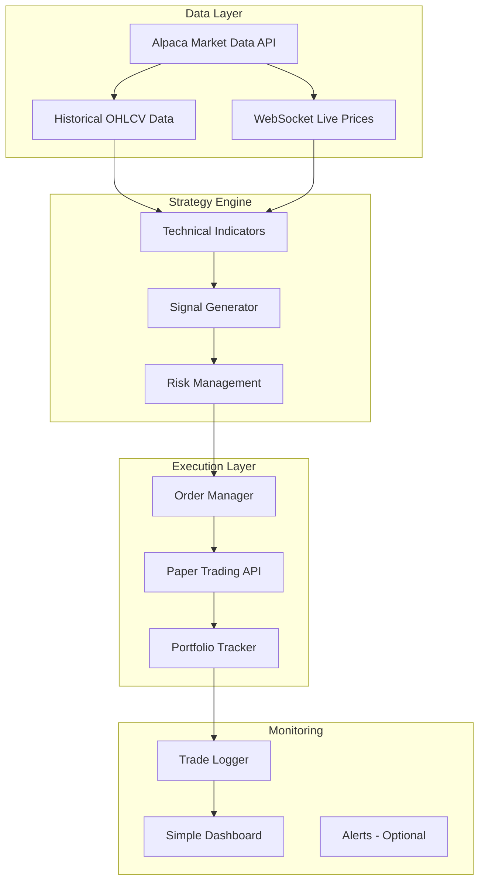
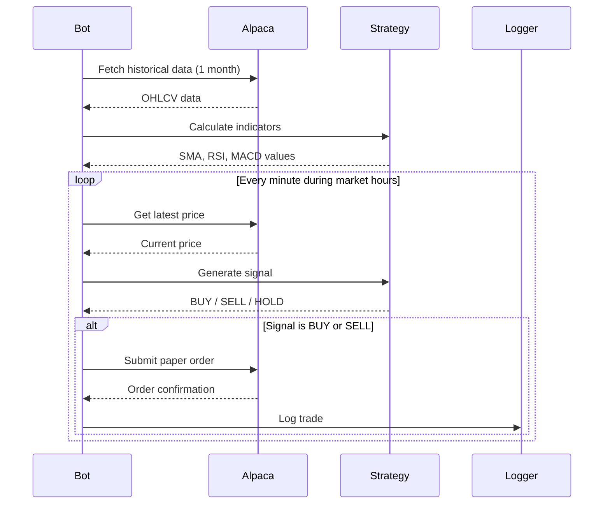

# Stock Trading Bot MVP

**Overview:** Build a paper trading bot that uses technical analysis indicators (moving averages, RSI) to generate buy/sell signals on stocks, using Alpaca's free paper trading API.

## Todos

| ID         | Task Description                                                    | Status  |
|------------|---------------------------------------------------------------------|---------|
| setup      | Create project structure and config with Alpaca API setup           | pending |
| data       | Implement data fetcher for historical and real-time market data     | pending |
| indicators | Build technical indicators module (SMA, EMA, RSI, MACD)             | pending |
| signals    | Create signal generation logic with configurable strategy           | pending |
| execution  | Implement order manager and portfolio tracker                       | pending |
| backtest   | Add backtesting capability for strategy validation                  | pending |
| monitoring | Add trade logging and simple dashboard                              | pending |


# Stock Trading Bot MVP Architecture

## Why This Stack?

- **Alpaca** - Free paper trading API with real market data, no minimum balance, excellent docs
- **Python** - De-facto standard for trading bots, rich ecosystem (pandas, pandas-ta)
- **Technical Analysis** - Well-understood signals, easy to implement and debug
- **alpaca-py** - The new official SDK (replaces deprecated `alpaca-trade-api`)
- **pandas-ta** - Pure Python, no C compilation needed (unlike TA-Lib)

---

## High-Level Architecture



---

## Core Components

### 1. Data Ingestion

- Fetch historical OHLCV (Open, High, Low, Close, Volume) data from Alpaca
- WebSocket connection for real-time price updates during market hours
- Store data in pandas DataFrames for analysis

### 2. Technical Indicators (using `ta` or `pandas-ta` library)

- **SMA/EMA** - Simple/Exponential Moving Averages (trend following)
- **RSI** - Relative Strength Index (overbought/oversold signals)
- **MACD** - Moving Average Convergence Divergence (momentum)

### 3. Signal Generation

Simple strategy example: "Golden Cross"

```python
# Buy when short MA crosses above long MA
# Sell when short MA crosses below long MA
if sma_20 > sma_50 and prev_sma_20 <= prev_sma_50:
    signal = "BUY"
elif sma_20 < sma_50 and prev_sma_20 >= prev_sma_50:
    signal = "SELL"
```

### 4. Risk Management

- Position sizing (e.g., never risk more than 2% per trade)
- Stop-loss orders
- Maximum daily loss limit

### 5. Order Execution

- Submit market/limit orders via Alpaca paper trading API
- Track open positions
- Handle partial fills

### 6. Monitoring

- Log all trades to CSV/SQLite
- Simple terminal dashboard showing P&amp;L
- Optional: Telegram/Discord alerts

---

## Directory Structure

```
trading-bot/
├── config/
│   └── settings.py          # API keys, parameters
├── data/
│   └── fetcher.py           # Alpaca data fetching
├── strategy/
│   ├── indicators.py        # Technical indicator calculations
│   └── signals.py           # Buy/sell signal logic
├── execution/
│   ├── order_manager.py     # Order submission
│   └── portfolio.py         # Position tracking
├── backtest/
│   └── backtester.py        # Test strategy on historical data
├── utils/
│   └── logger.py            # Trade logging
├── main.py                  # Entry point
├── requirements.txt
└── README.md
```

---

## Key Dependencies (Verified Jan 2026)

```
alpaca-py           # Official Alpaca SDK (replaces deprecated alpaca-trade-api)
pandas              # Data manipulation
pandas-ta           # Technical indicators (v0.3.14b0, actively maintained)
python-dotenv       # Environment variables
schedule            # Job scheduling (optional)
```

**Note:** `alpaca-trade-api` is deprecated. Use `alpaca-py` which has:
- Better async/await support
- Cleaner API design
- Active maintenance

---

## MVP Workflow



---

## Getting Started Steps

1. **Create Alpaca Account** - Sign up at alpaca.markets (free, no deposit needed for paper trading)
2. **Get API Keys** - From the paper trading dashboard
3. **Set up Python environment** - virtualenv + install dependencies
4. **Implement data fetcher** - Pull historical data, test connection
5. **Add indicators** - Start with simple SMA crossover
6. **Add signal logic** - Generate BUY/SELL based on indicators
7. **Connect to paper trading** - Submit orders via Alpaca
8. **Add backtesting** - Test strategy on historical data before live paper trading
9. **Run and monitor** - Let it trade, analyze results

---

## Time Estimate

| Component | Effort |

|-----------|--------|

| Setup + Data fetching | 2-3 hours |

| Technical indicators | 2-3 hours |

| Signal generation | 2-3 hours |

| Order execution | 3-4 hours |

| Backtesting | 3-4 hours |

| Monitoring/logging | 2-3 hours |

| **Total MVP** | **~15-20 hours** |

---

## Next Steps After MVP

- Add more sophisticated strategies (multi-indicator confluence)
- Machine learning signal enhancement
- Multi-stock screening
- Web dashboard for monitoring
- Transition to real trading (same API, just switch keys)

Would you like me to start implementing this? I can begin with the project structure and data fetching layer.
